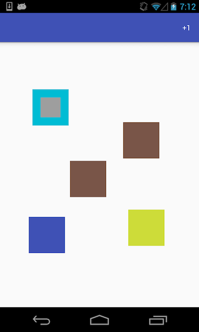

# CustomLayoutExample

Aim of this sample to understand essentials of developing custom layouts (also known as ViewGroup).

This custom layout just simple adds new view on place of finger touch.
View itself has custom states. For simplicity it only has two states: default and selected.

    

Custom layout implementation: [MyLayout.java](https://github.com/ysered/CustomLayoutExample/blob/master/app/src/main/java/com/ysered/customlayoutexample/view/MyLayout.java)

Custom view implementation: [MyView.java](https://github.com/ysered/CustomLayoutExample/blob/master/app/src/main/java/com/ysered/customlayoutexample/view/MyView.java)
